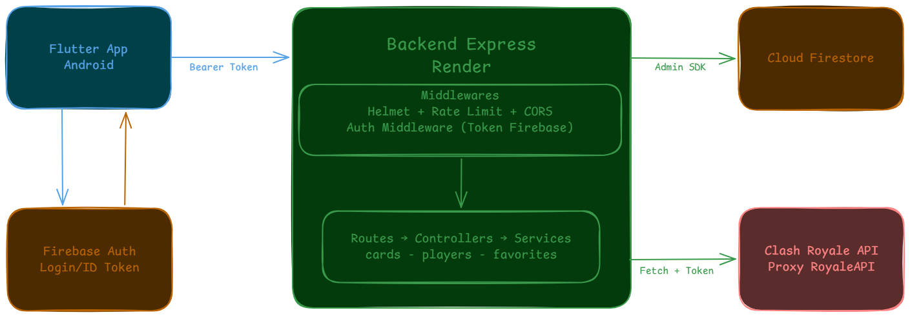
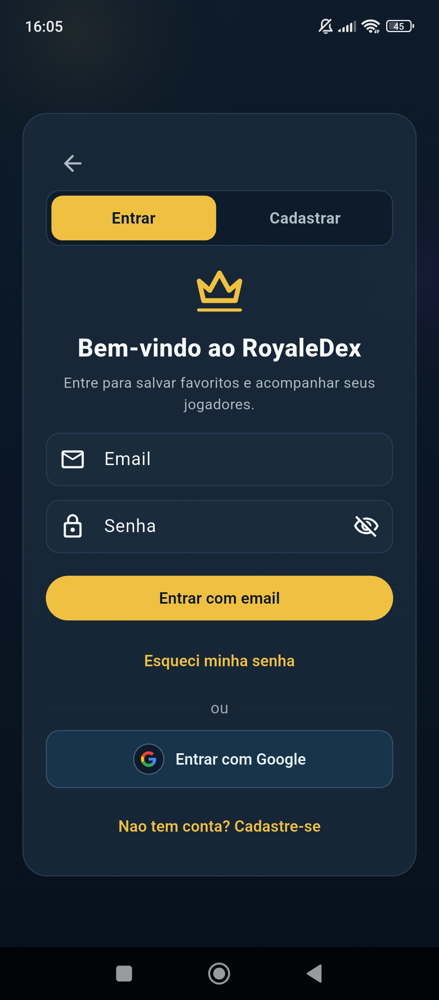
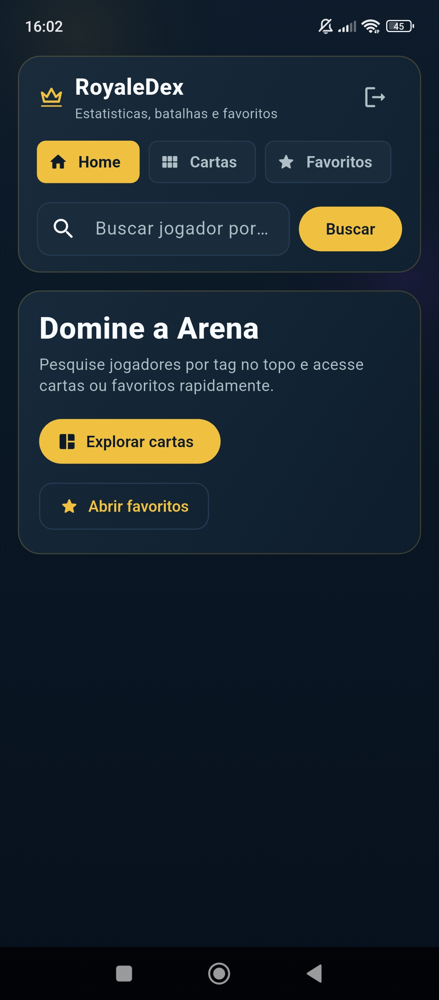
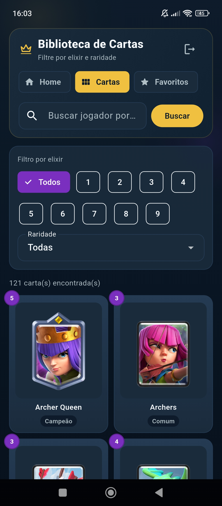
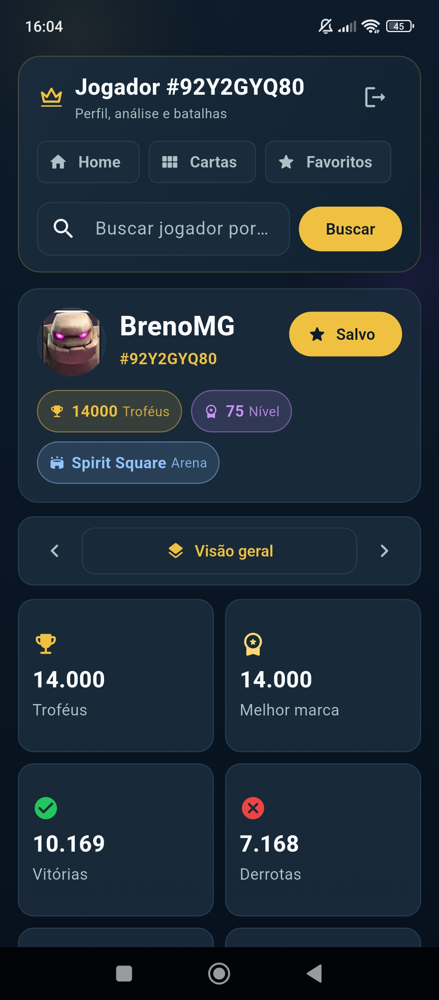
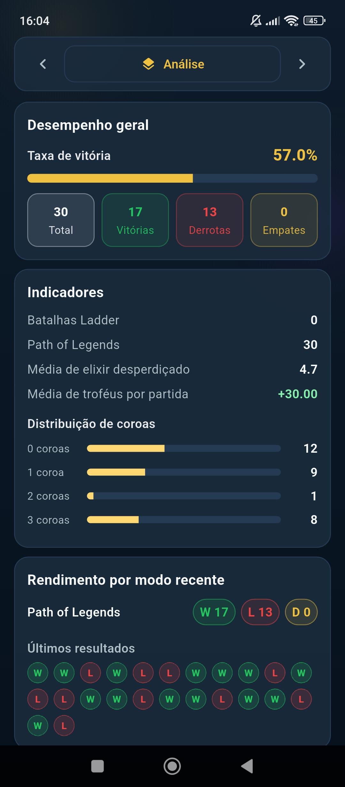
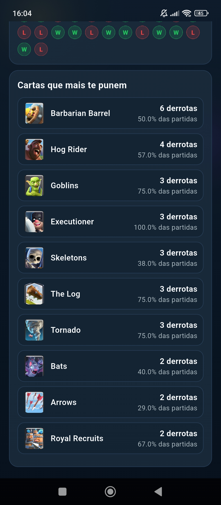
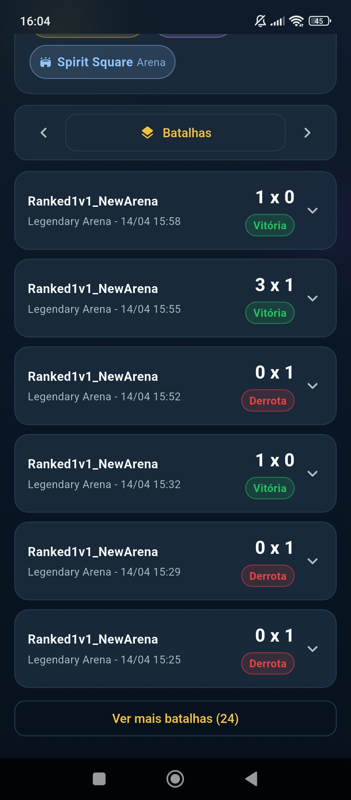
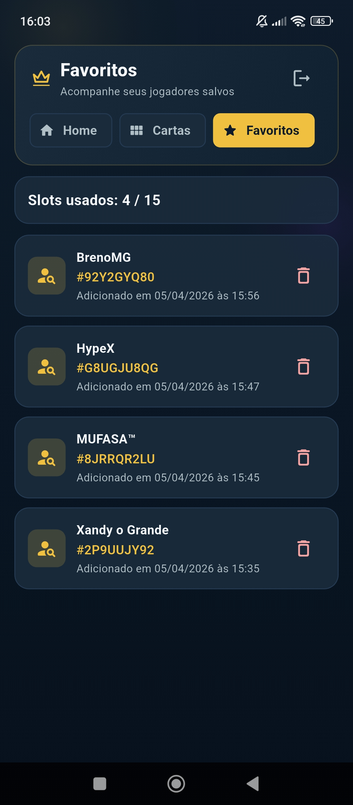

# RoyaleDex App

Aplicativo mobile em Flutter para consulta de estatísticas e cartas do Clash Royale, com autenticação via Firebase Auth e consumo da API do projeto.

## 📱 Testar ou baixar

- **APK Android:** [Github Release](https://github.com/breno-ceribeli/royaledex/releases/tag/v1.0.0)
- **Versão web Flutter:** *Ainda não hospedado*

---

## Tecnologias utilizadas

- Flutter
- Dart
- Firebase Auth
- FlutterFire CLI
- Provider
- Go Router
- HTTP

---

## Arquitetura da aplicação



Fluxo resumido:

1. O app Flutter gerencia estado com Provider e navegação com Go Router.
2. A autenticação é feita com Firebase Auth, que emite um ID Token.
3. O app envia requisições ao backend com o token no header `Authorization`.
4. O backend integra com a Clash Royale API e o Firestore e retorna os dados.

---

## Prints da aplicação

<table>
  <tr>
    <td align="center"><strong>Login</strong><br/></td>
    <td align="center"><strong>Home</strong><br/></td>
  </tr>
  <tr>
    <td align="center"><strong>Cartas</strong><br/></td>
    <td align="center"><strong>Perfil do jogador</strong><br/></td>
  </tr>
  <tr>
    <td align="center"><strong>Análise do jogador</strong><br/></td>
    <td align="center"><strong>Análise complementar</strong><br/></td>
  </tr>
  <tr>
    <td align="center"><strong>Histórico de batalhas</strong><br/></td>
    <td align="center"><strong>Favoritos</strong><br/></td>
  </tr>
</table>

---

## Como executar localmente

### Pré-requisitos

- Flutter SDK 3.24 ou superior
- Android SDK e emulador Android configurados
- Firebase CLI e FlutterFire CLI instalados
- Backend do projeto rodando localmente

### 1. Instalar dependências

```cmd
cd app
flutter pub get
```

### 2. Configurar variáveis de ambiente

Crie o arquivo `.env` a partir do template:

```cmd
copy .env.example .env
```

Conteúdo esperado:

```env
API_URL=http://10.0.2.2:3001
```

> `10.0.2.2` é o endereço que o emulador Android usa para acessar o `localhost` da máquina host.

### 3. Configurar Firebase

Gere o arquivo `lib/firebase_options.dart` (não versionado):

```cmd
flutterfire configure --project=royaledex-clash --platforms=android,web --out=lib/firebase_options.dart
```

Certifique-se também de que o arquivo `android/app/google-services.json` está presente.

### 4. Rodar no emulador Android

```cmd
flutter run --dart-define=API_URL=http://10.0.2.2:3001
```

---

## Build de release (APK)

```cmd
flutter build apk --release --dart-define=API_URL=https://royaledex.onrender.com
```

Saída esperada:

```
build/app/outputs/flutter-apk/app-release.apk
```

---

## Troubleshooting

| Problema | Solução |
|---|---|
| Erro de inicialização do Firebase | Verifique `lib/firebase_options.dart` e `google-services.json` |
| Falha de conexão com a API | Revise `API_URL` no `.env` ou no `--dart-define` |
| Backend local não responde no emulador | Use `10.0.2.2` no lugar de `localhost` |
| Login com Google não funciona | Verifique se o SHA-1 do keystore está cadastrado no Firebase |
