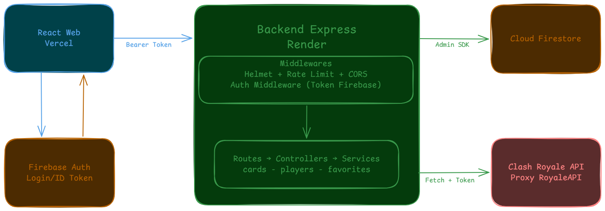
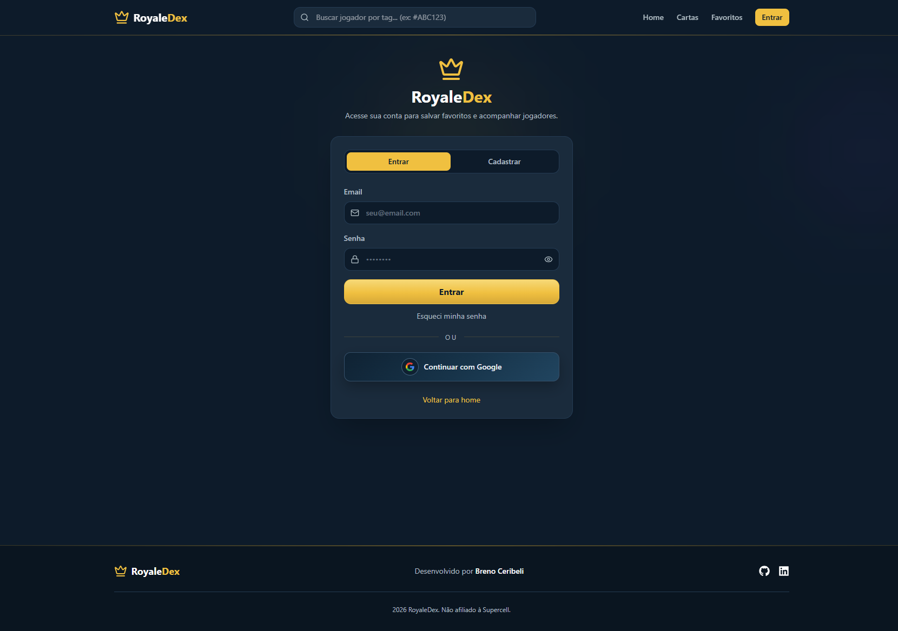
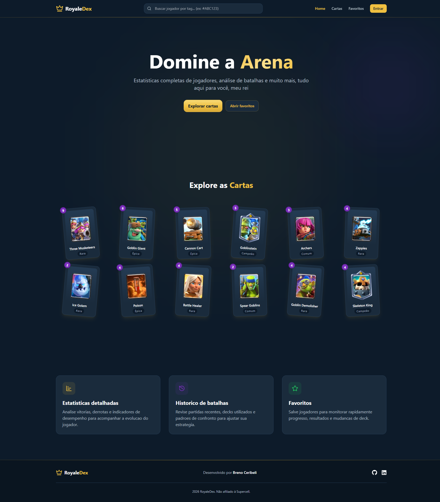
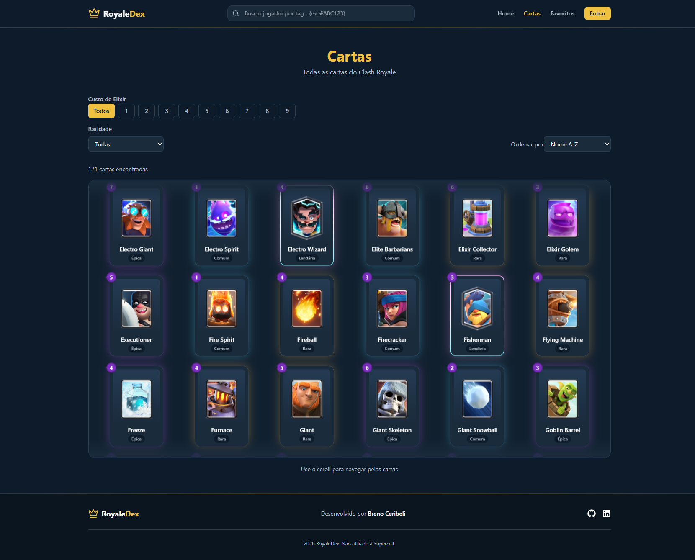
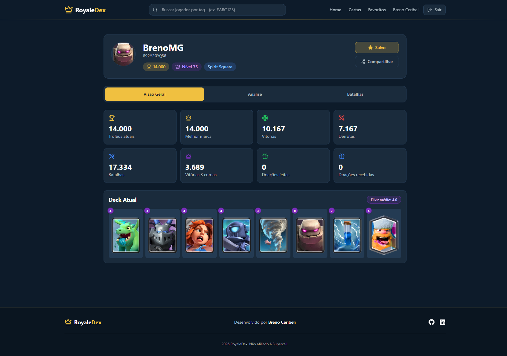
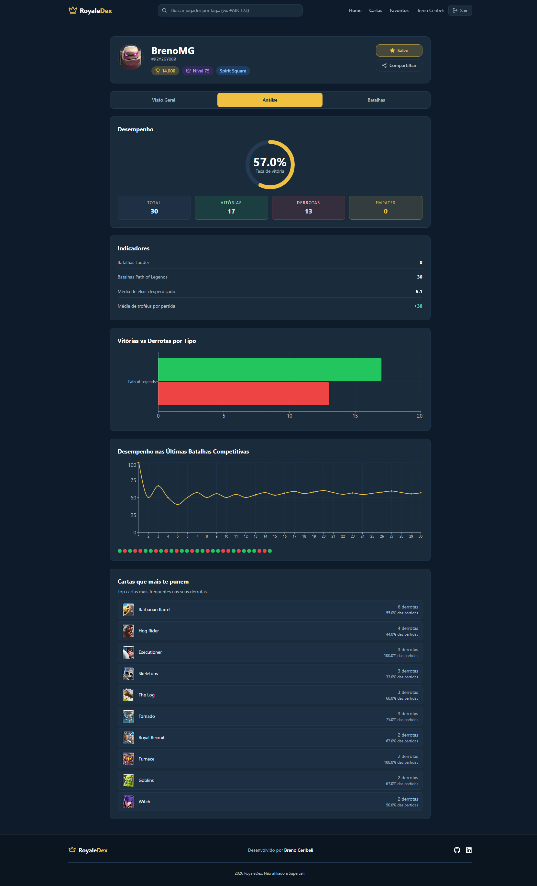
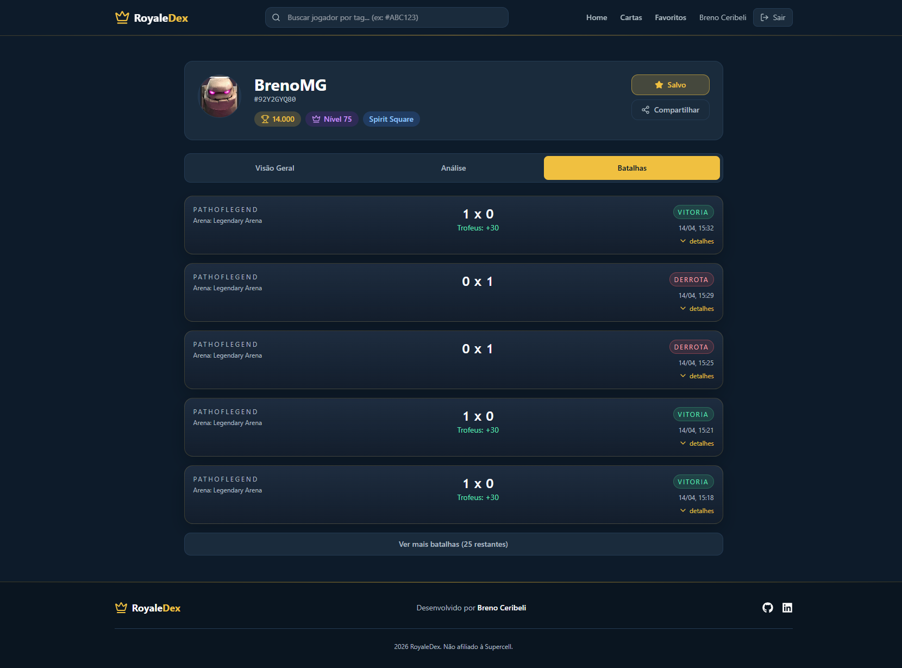
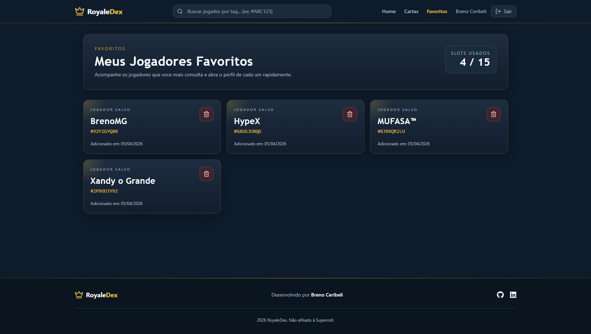

# RoyaleDex Web

Aplicação web em React para consulta de estatísticas do Clash Royale, com autenticação via Firebase e integração com API externa por meio do backend do projeto.

## 🌐 Acesse online

**[royaledex.vercel.app](https://royaledex.vercel.app)**

---

## Tecnologias utilizadas

- React 19
- TypeScript
- Vite
- React Router DOM
- Firebase Auth
- Axios
- Tailwind CSS

---

## Arquitetura da aplicação



Fluxo resumido:

1. A interface React gerencia estado e rotas.
2. A autenticação é feita diretamente com Firebase Auth, que emite um ID Token.
3. O frontend envia requisições ao backend com o token no header `Authorization`.
4. O backend consulta a Clash Royale API e o Firestore e retorna os dados.

---

## Telas da aplicação

### Login


### Home


### Cartas


### Perfil do jogador


### Análise do jogador


### Histórico de batalhas


### Favoritos


---

## Rotas principais

| Rota | Descrição |
|---|---|
| `/` | Página inicial |
| `/login` | Autenticação |
| `/cards` | Listagem e filtros de cartas |
| `/players/:tag` | Perfil dinâmico de jogador |
| `/favorites` | Favoritos (rota protegida) |

---

## Como executar localmente

### Pré-requisitos

- Node.js 18 ou superior
- npm 9 ou superior
- Backend do projeto rodando localmente

### 1. Instalar dependências

```cmd
cd web
npm install
```

### 2. Configurar variáveis de ambiente

Crie o arquivo `.env` a partir do template:

```cmd
copy .env.example .env
```

Preencha as variáveis com os valores do seu projeto Firebase:

```env
VITE_API_URL=http://localhost:3001
VITE_FIREBASE_API_KEY=
VITE_FIREBASE_AUTH_DOMAIN=
VITE_FIREBASE_PROJECT_ID=
VITE_FIREBASE_STORAGE_BUCKET=
VITE_FIREBASE_MESSAGING_SENDER_ID=
VITE_FIREBASE_APP_ID=
```

### 3. Rodar em desenvolvimento

```bash
npm run dev
```

Aplicação disponível em: `http://localhost:5173`

### 4. Build de produção

```bash
npm run build
npm run preview
```

---

## Troubleshooting

| Problema | Solução |
|---|---|
| Erro no login com Firebase | Revise as variáveis `VITE_FIREBASE_*` no `.env` |
| Erro de CORS ou falha nas chamadas | Confirme `VITE_API_URL` e `ALLOWED_ORIGINS` no backend |
| Página em branco após build | Verifique se `npm run build` concluiu sem erros |
